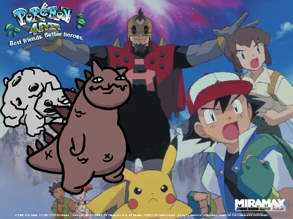

## Kaiju 4Ever

[Nexus Mods](https://www.nexusmods.com/mewgenics/mods/328) | [GitHub](https://github.com/p0lymeric/mewgenics_kaiju_4ever)

## Use

Makes it so that a kaiju is always present in the background of the house, even on a fresh save and after unlocking the Rift!

This mod only affects rendering logic, and should have no permanent effects on a save.

Three downloads are provided for convenience, differing in a text value stored in `config.txt`. Only one should be loaded at a given time.
* Pyrophina fans should download kaiju_4ever_pyrophina-*.zip, which forces Pyrophina to always appear.
* Zaratana fans should download kaiju_4ever_zaratana-*.zip, which forces Zaratana to always appear.
* Team Rocket fans could download kaiju_never-*.zip, which instead prevents any kaiju from appearing behind the house.

## Installation requirements

This mod is packaged for the [Mewtator](https://www.nexusmods.com/mewgenics/mods/1) mod loader and [Mewjector](https://www.nexusmods.com/mewgenics/mods/218) dll loader.

Both are highly recommended for a standard install.

If you encounter crashes or cannot trigger item shuffling, please verify:
* the version of Mewgenics you have installed matches the required version specified in this mod's release notes.
* you have the latest versions of [Mewtator](https://www.nexusmods.com/mewgenics/mods/1) and [Mewjector](https://www.nexusmods.com/mewgenics/mods/218) installed.
* you have dll mod support enabled in Mewtator.

Note that since the Mewgenics dll modding scene is still in its infancy, and because the developers have active plans to release fixes and new content, this mod will likely break in the future with each game update.

## Build requirements

This repository is self-contained, apart from tooling (all C/C++ source code, including that of dependencies, is included).

To compile the dll from source, [CMake](https://cmake.org/) and a contemporary version of the [MSVC compiler (2022/2026)](https://visualstudio.microsoft.com/downloads/) are required.

Developers may appreciate that this dll can be injected standalone with the tool provided under `cpp/cosmic_ooze`, or another tool such as Cheat Engine or System Informer. Players should use Mewjector.

## Credits/Licensing

Credits to JamJuice in the Mewgenics modding discord for the idea!

All original material outside of `third_party` directories are distributed under the MIT license. See [LICENSE.md](LICENSE.md) for details.

See [ATTRIBUTION.md](ATTRIBUTION.md) and license documents under `third_party` directories for dependency licenses.
